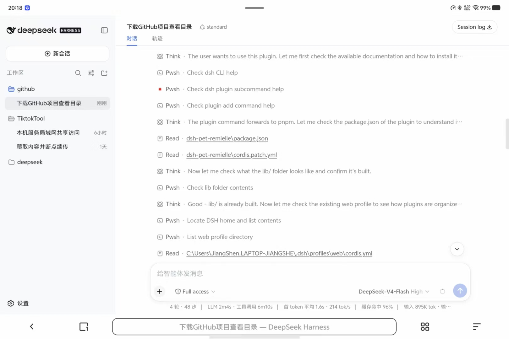

# dsh-lan-plugin

> A dsh plugin I built — fixes LAN access. Tagged `dsh-plugin` per upstream's stated contribution convention.
>
> 我给 [dsh](https://github.com/deepseek-ai/deepseek-harness) 写的一个插件——修局域网访问。挂了 `dsh-plugin` topic（上游明文鼓励的贡献方式）。
>
> 完整中文说明：[README.zh.md](README.zh.md)

[](https://github.com/topics/dsh-plugin)
[](packages/dsh-lan-fix/LICENSE)

This monorepo ships dsh plugins that follow the official `dsh-plugin` distribution conventions (npm package + `cordis.patch.yml` + profile-node_modules symlink). No `dsh` source is modified.

本 monorepo 收录的 dsh 插件遵循官方 `dsh-plugin` 规范（npm 包 + `cordis.patch.yml` + profile node_modules 软链接），**不改 dsh 任何源码**。



*Real capture: a phone on the same WiFi opening `http://<lan-ip>:3080/` after the LAN fix is installed — same `dsh web` session as the PC's `http://127.0.0.1:3080/`.*

*实拍：手机连同一个 WiFi，打开 `http://<lan-ip>:3080/`，session 列表 / 聊天记录 / 工具栏跟电脑 `http://127.0.0.1:3080/` 上看到的一模一样，不用装任何 app。*

## Why this repo exists | 为什么有这个仓库

`deepseek-ai/deepseek-harness` is in pre-release. From their `CONTRIBUTING.md`:

> "We are sorry that we cannot accept external pull requests at the moment."

The repo also has `has_pull_requests: false` at the repo level, so external PRs are server-blocked for now. They explicitly recommend the contribution path: publish plugins with the `dsh-plugin` topic — this repo follows that path.

`deepseek-ai/deepseek-harness` 还在 pre-release，他们的 `CONTRIBUTING.md` 写得直白：

> "We are sorry that we cannot accept external pull requests at the moment."

仓库层面也设了 `has_pull_requests: false`，外部 PR 暂时走不通。他们明文推荐的贡献方式就是发带 `dsh-plugin` topic 的独立插件——这条仓库就专门走那条路。

Each plugin here changes very little (often one method, a line or two of fallback), so it slots in cleanly when upstream opens up. The body of every monkey-patch doubles as a draft of the eventual upstream diff.

每个 plugin 实际改的就那么点东西（常常是一个方法、一两行 fallback），上游哪天开门直接就是 compatible 的 diff。这边 monkey-patch 的函数体，留着当未来 upstream PR 的草稿也合适。

## Plugins | 插件列表

| Package / 包名 | What it fixes / 修什么 |
|---|---|
| [`@zynieie/dsh-lan-fix`](packages/dsh-lan-fix/) | Lets `dsh web` load on `http://<lan-ip>:3080/` (insecure context) without the WebSocket abort storm. Patches `AbstractApiClient.mintRpcId` to fall back to `crypto.getRandomValues` when `crypto.randomUUID` is unavailable.<br><br>让 `dsh web` 在 `http://<lan-ip>:3080/`（insecure context）下能加载，不再卡空白。monkey-patch `AbstractApiClient.mintRpcId`，没有 `crypto.randomUUID` 时回落到 `crypto.getRandomValues`。 |

## Repo layout | 仓库结构

```
.
├── packages/
│   └── dsh-lan-fix/          # the LAN access plugin
│       ├── src/index.ts      # plugin entry (monkey-patch)
│       ├── cordis.patch.yml  # Cordis bundle-patch layer
│       ├── package.json      # dsh.bundle.patch → cordis.patch.yml
│       ├── README.md         # English
│       ├── README.zh.md      # 中文
│       ├── tsconfig.json
│       ├── tsconfig.build.json
│       ├── tests/            # node --test sanity tests
│       └── LICENSE           # MIT
├── docs/
│   ├── lan-access.md         # long-form write-up (root cause, verification, security)
│   └── images/               # phone screenshot
├── pnpm-workspace.yaml
├── README.md                 # this file (中英双语)
├── README.zh.md              # 完整中文版
└── .gitignore
```

## Install any plugin | 安装任意 plugin

Each plugin ships as an npm package; install it into the `node_modules/` of your dsh profile checkout (or symlink the workspace package in):

每个 plugin 是 npm 包；装到你 dsh profile 仓库的 `node_modules/` 里（或者 symlink 工作区包）：

```sh
# from inside your dsh profile repo
pnpm add --save-dev /absolute/path/to/dsh-lan-plugin/packages/dsh-lan-fix
# or symlink:
ln -s /absolute/path/to/dsh-lan-plugin/packages/dsh-lan-fix \
      ./node_modules/@zynieie/dsh-lan-fix

pnpm dsh web --host 0.0.0.0
```

The dsh bundle-loader walks patch layers in dependency order. Each plugin's `apply()` runs before any web-app row that would otherwise build an `AbstractApiClient`, so every subclass inherits the patched prototype through the prototype chain.

dsh bundle-loader 按依赖顺序走 patch 层。每个 plugin 的 `apply()` 在 web-app 任何构造 `AbstractApiClient` 的 row 之前执行，所以所有子类通过原型链都拿到补丁。

## Contributing | 贡献

Open an issue, send a PR to this repo, or open a discussion. The plugins here follow the same shape as upstream's `packages/bundle/*` — small, focused, single-responsibility — so contributions are usually one-method edits in `src/index.ts`.

提 issue、发 PR、开 discussion 都行。这里的 plugin 沿用上游 `packages/bundle/*` 的形态——小、专注、单职责——所以贡献通常就是 `src/index.ts` 里一个方法的小改。

## License | 许可证

MIT per package — see [`packages/dsh-lan-fix/LICENSE`](packages/dsh-lan-fix/LICENSE).

每个包都是 MIT——见 [`packages/dsh-lan-fix/LICENSE`](packages/dsh-lan-fix/LICENSE)。
